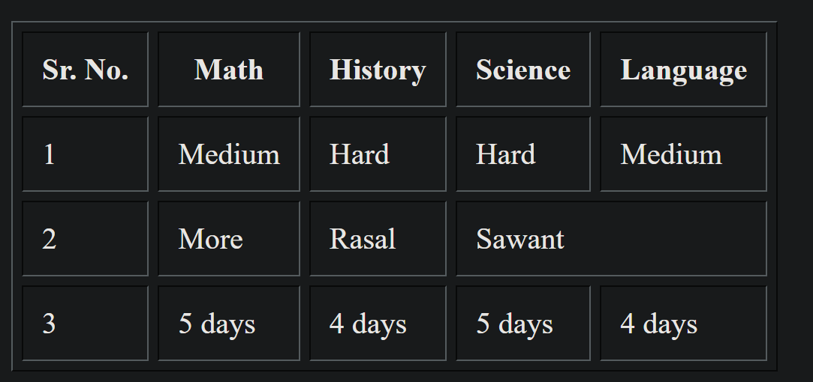

# Explanation of HTML Tables and Highlighted Code Examples

This document explains various HTML table attributes and techniques as demonstrated in the provided HTML code. Each section includes the corresponding code snippet, the table's appearance, and an explanation. Comments and paragraphs from the original code are included.  
(The md documentation henceforth will be AI generated to save time, but they're based on the pinned html files themselves and the outputs are manually appended ( ͡~ ͜ʖ ͡°).)  

---

## Basic Table Example

### Code:
```html
<table>
    <tr>
        <th>Sr. No.</th>
        <th>Math</th>
        <th>Science</th>
        <th>History</th>
        <th>Language</th>
    </tr>
    <tr>
        <td>1</td>
        <td>Medium</td>
        <td>Hard</td>
        <td>Hard</td>
        <td>Medium</td>
    </tr>
    <tr>
        <td>2</td>
        <td>More</td>
        <td>Rasal</td>
        <td>Sawant</td>
        <td>Bhosale</td>
    </tr>
    <tr>
        <td>3</td>
        <td>5 days</td>
        <td>4 days</td>
        <td>5 days</td>
        <td>4 days</td>
    </tr>
</table>
```

### Output:


### Explanation:
- A simple table is created using `<table>`, with rows (`<tr>`), headers (`<th>`), and data cells (`<td>`).

---

## Table with Border Attribute

### Code:
```html
<table border="">
    <tr>
        <th>Sr. No.</th>
        <th>Math</th>
        <th>Science</th>
        <th>History</th>
        <th>Language</th>
    </tr>
    <tr>
        <td>1</td>
        <td>Medium</td>
        <td>Hard</td>
        <td>Hard</td>
        <td>Medium</td>
    </tr>
    <tr>
        <td>2</td>
        <td>More</td>
        <td>Rasal</td>
        <td>Sawant</td>
        <td>Bhosale</td>
    </tr>
    <tr>
        <td>3</td>
        <td>5 days</td>
        <td>4 days</td>
        <td>5 days</td>
        <td>4 days</td>
    </tr>
</table>
```

### Output:

### Explanation:
- The `border` attribute creates a visible border for the table.

---

## Table with Cell Padding

### Code:
```html
<table border="" cellpadding="10px">
    <tr>
        <th>Sr. No.</th>
        <th>Math</th>
        <th>Science</th>
        <th>History</th>
        <th>Language</th>
    </tr>
    <tr>
        <td>1</td>
        <td>Medium</td>
        <td>Hard</td>
        <td>Hard</td>
        <td>Medium</td>
    </tr>
    <tr>
        <td>2</td>
        <td>More</td>
        <td>Rasal</td>
        <td>Sawant</td>
        <td>Bhosale</td>
    </tr>
    <tr>
        <td>3</td>
        <td>5 days</td>
        <td>4 days</td>
        <td>5 days</td>
        <td>4 days</td>
    </tr>
</table>
```

### Output:

### Explanation:
- The `cellpadding` attribute adds space inside each cell, improving readability.

---

## Table with Cell Spacing

### Code:
```html
<table border="" cellpadding="10px" cellspacing="5px">
    <tr>
        <th>Sr. No.</th>
        <th>Math</th>
        <th>Science</th>
        <th>History</th>
        <th>Language</th>
    </tr>
    <tr>
        <td>1</td>
        <td>Medium</td>
        <td>Hard</td>
        <td>Hard</td>
        <td>Medium</td>
    </tr>
    <tr>
        <td>2</td>
        <td>More</td>
        <td>Rasal</td>
        <td>Sawant</td>
        <td>Bhosale</td>
    </tr>
    <tr>
        <td>3</td>
        <td>5 days</td>
        <td>4 days</td>
        <td>5 days</td>
        <td>4 days</td>
    </tr>
</table>
```

### Output:


### Explanation:
- The `cellspacing` attribute adds space between cells, distinguishing them further.

---

## Deleted elements

### Code:
```html
    <table border="" cellpadding="10px" cellspacing="5px" > 
        <tr>
            <th>Sr. No.</th>
            <th>Math</th>
            <th>History</th>
            <th>Science</th>
        </tr>
        <tr>
            <td>1</td>
            <td>Medium</td>
            <td>Hard</td>
            <td>Hard</td>
            <td>Medium</td>
        </tr>
        <tr>
            <td>2</td>
            <td>More</td>
            <td>Rasal</td>
            <td>Sawant</td>
            <td>Bhosale</td>
        </tr>
        <tr>
            <td>3</td>
            <td>5 days</td>
            <td>4 days</td>
            <td>5 days</td>
            <td></td>
        </tr>
    </table>  
```

### Output:


### Explanation:
- We can also observe that each data entry is by default in its own cell. Eg. if I remove the last attribute from the table, and also make the days alloted as an empty entry, it looks like this. In one case, a blank space is seen and in other, a blank cell is noticed.

---
## Using `colspan` to Merge Cells

### Code:
```html
<table border="" cellpadding="10px" cellspacing="5px">
    <tr>
        <th>Sr. No.</th>
        <th>Math</th>
        <th>History</th>
        <th>Science</th>
        <th>Language</th>
    </tr>
    <tr>
        <td>2</td>
        <td>More</td>
        <td>Rasal</td>
        <td colspan="2">Sawant</td>
    </tr>
</table>
```

### Output:


### Explanation:
- The `colspan` attribute merges multiple columns, as shown with "Sawant" occupying both Science and Language.

---

## Using `rowspan` to Merge Rows

### Code:
```html
<table border cellpadding="5px" cellspacing="5px" bordercolor="silver">
    <tr>
        <th>Sr.no/ Subject</th>
        <th>Difficulty</th>
        <th>Teacher</th>
        <th>Days alloted</th>
    </tr>
    <tr>
        <td>3. Science</td>
        <td rowspan="2">Hard</td>
        <td rowspan="2">Sawant</td>
        <td>5 days</td>
    </tr>
    <tr>
        <td>4. Language</td>
        <td>4 days</td>
    </tr>
</table>
```

### Output:


### Explanation:
- The `rowspan` attribute merges rows, with "Hard" and "Sawant" spanning Science and Language.

---