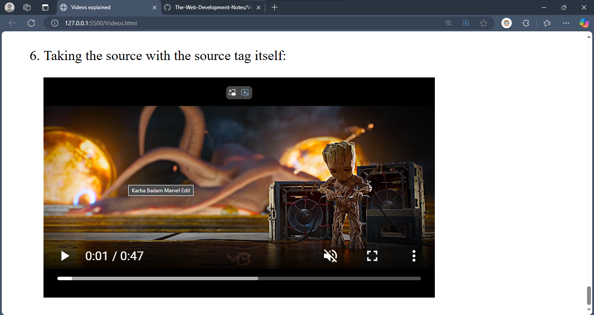

Videos are the second important type of multimedia after images used to give information about the landing page.

Like the images, we can import the videos on the webpage from the system itslef and also from external web addresses. To get sample images or videos, i.e. free stock images and videos, we can use the following websites: ***pexels, pixabay and unsplash***. Here, I'm using the stock videos from **pexels**.

There are two ways to use the `<video>` tag:

`1]` `<video` src="">`</video>`:  

Here we include the video using its source's link in the `src` attribute. Eg: ` 
`<video` `src="https://videos.pexels.com/video-files/27906428/12258956_360_640_25fps.mp4"`>Morning bliss`</video>` displays:  
[Watch this video](video1.mp4)

The text "Morning bliss" is an alternative, optional text and appears if video cannot be diaplayed.

Here, we see that above video appears just as an image with no video controls. For that, we add the controls attribute.
`<video` src="https://videos.pexels.com/video-files/27906428/12258956_360_640_25fps.mp4" controls>Morning bliss`</video>`  displays:  
[Watch this video](video2.mp4)

We see that video starts only after clicking the video.   If we want it to autostart after loading the page, we add the autoplay attribute.
`<video` src="https://videos.pexels.com/video-files/27906428/12258956_360_640_25fps.mp4" controls autoplay>Morning bliss`</video>`

Though, above feature may be unpleasent to the users if the video gives out loud sound.  For this, we add the muted attribute.  
`<video` src="https://videos.pexels.com/video-files/27906428/12258956_360_640_25fps.mp4" controls autoplay muted>`</video>`  displays:  
[Watch this video](video3.mp4)

In modern browsers HTML pages don't render the autoplay feature with the autoplay attribute alone, but also require the muted attribute.  
If a video has the muted attribute but not the autoplay attribute, it won't start automatically, but by dafault the volume is muted unless unmuted with the controls. Eg: 

`<video` src="Marvel  Kacha Badam.mp4" controls muted width="400">`</video>`  displays:  
[Watch this video](video4.mp4)

Just like images, the video's frame can be resized by pixels by "height" and "width". To maintain the aspect ratio, we prefer to change the value of only one of them. Eg: 

`<video` src="https://videos.pexels.com/video-files/27906428/12258956_360_640_25fps.mp4" controls muted width="600">`</video>`  displays:  
[Watch this video](video5.mp4)
---

`2]` `<video controls>`    
  `<source >`  
  `<source >`  
`</video>`:  
This type of video tag is used in case the server cannot handle fetching the same file for the multiple users at the same time and thus we provide multiple sources to the same file in multiple formats or just different paths to the similar files in multiple directories. This is the benifit of this technique. However it is not as readable and flexible as the previous technique. Eg:  
        `
`Using the source with the source tag itself:`
`
        `<video` controls muted>
            `<source` src="Marvel  Kacha Badam.mp4" type="video/mp4"> <!--For fetching the mp4 file-->
            `<source` src="Marvel  Kacha Badam.mkv" type="video/mkv"> <!--To get the mkv file in case the user can't access the mp4 file-->
        `</video>`
        displays:  
[Watch this video](video6.mp4)        

In the above video, we also added the title attribute to give the video a title that appears on hovering on it.

